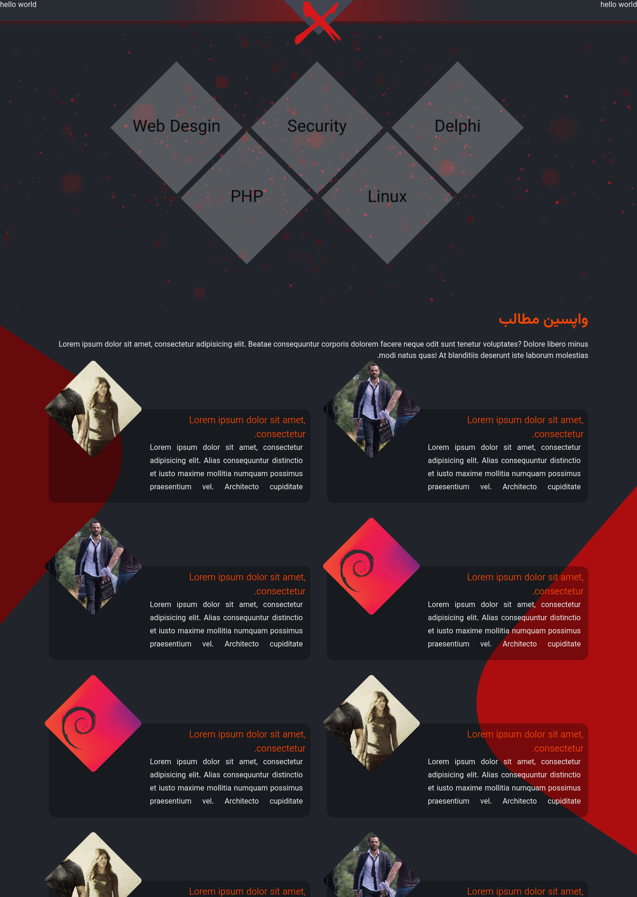
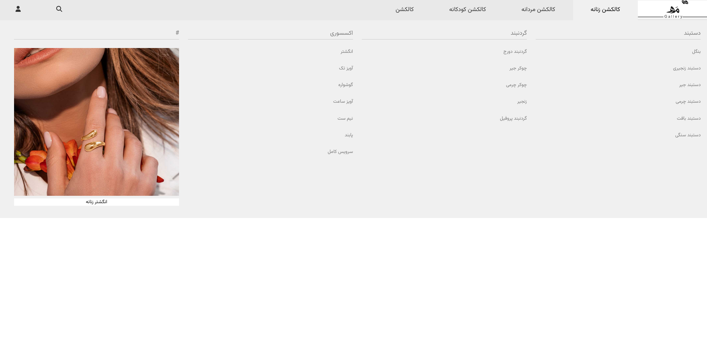
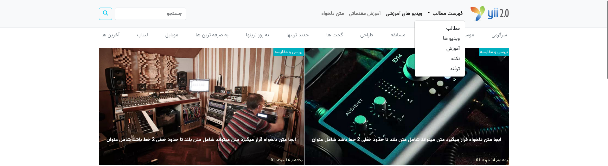
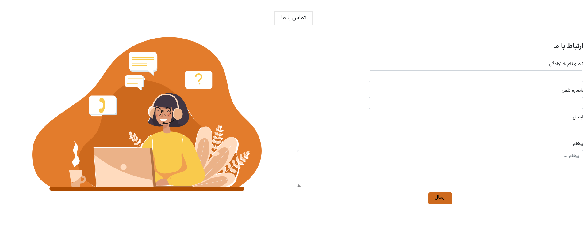
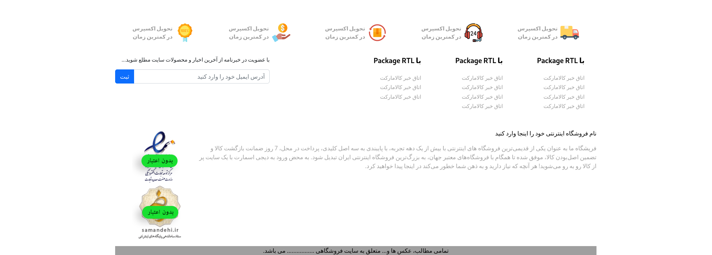
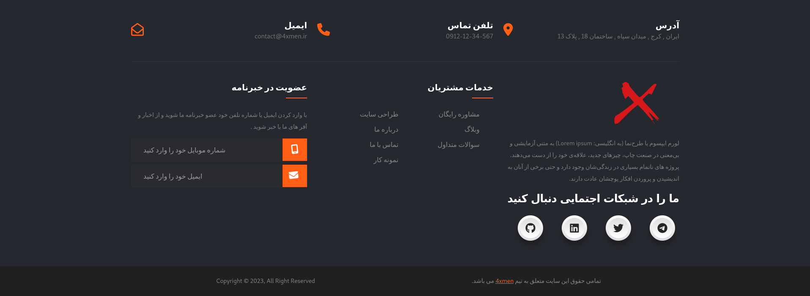
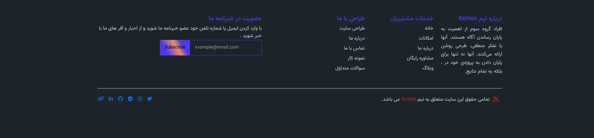

<h1 align="center">
   
  
   
  <a href="https://github.com/4xmen/Web-Package-RTL">Web Package (RTL)</a>
   
  

</h1>

# Web Package (RTL)

If you want A Full Web Package Direction RTL that is usefull For WebPages easy to use and Sorted by folders - This package is usefull for you ... :)

## How use it?
U Can Download As zip and use any package you need for your website . ( Use Npm install just in folders of any package you want to use it. )

# Demo

<h2> Xmen Template </h2>

<h2>Mega Menu </h2>

<h2>Navbar #1 </h2>

<h2>Contact Form</h2>

<h2>Footer #1</h2>

<h2>Footer #2</h2>

<h2>Footer #3</h2>

## Features

| name  | default  |  action  |
| ------------ | ------------ | ------------ |
| responseWidth  |  `1024`  |  active mobile mode (side menu)  |
| barsIcon |  -  |  any html element use for toggle bar   |
| mainTitle  | `Navbar menu`  | change main menu title   |
| isRtl  |  `True` |  Default Rtl |
|  blurEffect | `false`  |  blur effect when menu active |
|  resetMenu | `true`  | reset side menu when close  |
|  disableLinks | `true`  | disable links when has sub menu click event otherwise on mouse enter show sub level   |

## Report Some Bugs
Find a Bug? Please, [create an issue](https://github.com/4xmen/Web-Package-RTL/issues) and we'll fix it together for a better template.

## Contribution
Contribution are always welcome and recommended! Here is how:

- Fork the repository ([here is the guide](https://help.github.com/articles/fork-a-repo/)).
- Clone to your machine git clone https://github.com/YOUR_USERNAME/Web-Package-RTL.git
- Make your changes
- Create a pull request

## Badges

## License

[GPL](https://www.gnu.org/licenses/gpl-3.0.en.html)

 Developed With Love ! ❤️

